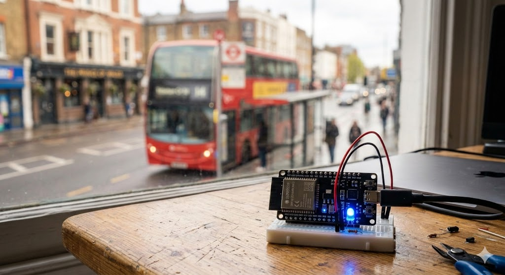

# ESP32 TfL Bus Indicator



Onboard RGB LED on an ESP32-S3 shows how soon the next bus arrives at your stop. Polls the [TfL Unified API](https://api.tfl.gov.uk/) every 30 seconds.

## LED Colours

| Nearest Bus | LED |
|---|---|
| >= 15 min or no data | Off |
| 10–14 min | Blue |
| 5–9 min | Yellow |
| 2–4 min | Red |
| 0–1 min | Flashing red |

## How It Works

The device connects to Wi-Fi and polls the TfL Unified API every 30 seconds for live arrivals at your configured stop. It filters the response to only the bus lines you're tracking, finds the nearest arrival, and converts the time-to-station into minutes. That minute value maps to an LED colour (see table above). Serial output logs each update with the line, destination, and colour — useful for debugging without needing to decode LED states.

## Hardware

- [ESP32-S3-DevKitC-1](https://amzn.to/40KIAMw) (any variant with onboard WS2812 RGB LED on GPIO48)
- USB-C cable for power and flashing

No additional wiring needed.

## Setup

1. Install [PlatformIO CLI](https://docs.platformio.org/en/latest/core/installation.html)

2. Copy the secrets example and fill in your details:
   ```bash
   cp secrets.example.ini secrets.ini
   ```

3. Edit `secrets.ini` with your Wi-Fi credentials, TfL stop ID, and bus lines:
   ```ini
   [env:esp32s3]
   build_src_flags =
       -DWIFI_SSID=\"your-wifi-name\"
       -DWIFI_PASSWORD=\"your-wifi-password\"
       -DTFL_STOP_ID=\"your-tfl-stop-naptan-id\"
       -DTRACKED_LINES=\"line1,line2,Nline1\"
   ```

4. Find your stop's NaptanId on the [TfL API](https://api.tfl.gov.uk/). Search for your stop at `https://api.tfl.gov.uk/StopPoint/Search/{query}` and use the `naptanId` field. Set `TRACKED_LINES` to a comma-separated list of bus line names you want to track (e.g. `\"73,390,N73\"`). Line names are case-sensitive and must match the `lineName` field from the TfL API exactly.

5. Build and flash:
   ```bash
   pio run -t upload && pio device monitor
   ```

## Configuration

Thresholds, LED settings, and poll interval can be adjusted in `include/config.h`.

## Project Structure

```
├── src/main.cpp           — application logic
├── include/config.h       — thresholds, LED, poll interval
├── secrets.ini            — Wi-Fi and TfL credentials (not committed)
├── secrets.example.ini    — template for secrets.ini
└── platformio.ini         — PlatformIO build config
```

## Troubleshooting

- **LED stays off** — check that your stop ID is correct and the line names in `TRACKED_LINES` match the TfL API response.
- **Wi-Fi connection failed** — verify `WIFI_SSID` and `WIFI_PASSWORD` in `secrets.ini`.
- **"No tracked arrivals" in serial** — line names must match the TfL `lineName` field exactly (case-sensitive). Open `https://api.tfl.gov.uk/StopPoint/{your-stop-id}/Arrivals` in a browser to check.
- **Viewing serial output** — run `pio device monitor` to see live logs from the device.

## Licence

MIT
