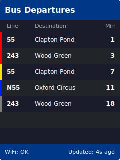

# ESP32 TfL Bus Indicator


Onboard RGB LED on an ESP32-S3 shows how soon the next bus arrives at your stop. Polls the [TfL Unified API](https://api.tfl.gov.uk/) every 30 seconds.

## LED Colours

| Nearest Bus | LED |
|---|---|
| >= 15 min or no data | Off |
| 10–14 min | Blue |
| 5–9 min | Yellow |
| 2–4 min | Red |
| 0–1 min | Flashing red |

## TFT Display

An ILI9341 2.8" TFT (240×320) shows up to 7 upcoming departures with line numbers, destinations, and countdown times — all colour-coded to match the LED thresholds. The countdown updates every second between API polls.

<p align="center">
  
</p>

### Wiring

| ILI9341 Pin | ESP32-S3 GPIO |
|---|---|
| CS | GPIO 10 |
| RST | GPIO 9 |
| DC | GPIO 8 |
| MOSI | GPIO 11 |
| SCK | GPIO 12 |
| LED | 3V3 |
| VCC | 3V3 |
| GND | GND |

## How It Works

The device connects to Wi-Fi and polls the TfL Unified API every 30 seconds for live arrivals at your configured stop. It filters the response to only the bus lines you're tracking, collects up to 8 arrivals sorted by time, and displays them on the TFT screen. The nearest arrival also drives the LED colour (see table above). Between polls, displayed minutes count down in real time. Serial output logs each update with the line, destination, and colour.

## Hardware

- [ESP32-S3-DevKitC-1](https://amzn.to/40KIAMw) (any variant with onboard WS2812 RGB LED on GPIO48)
- [ILI9341 2.8" SPI TFT display](https://amzn.to/3YQ4Lkw) (240×320, 4-wire SPI)
- USB-C cable for power and flashing

## Setup

1. Install [PlatformIO CLI](https://docs.platformio.org/en/latest/core/installation.html)

2. Build and flash:
   ```bash
   pio run -t upload
   ```

3. The device starts a Wi-Fi hotspot called **BusIndicator-XXYYZZ** (the LED pulses blue). Connect to it with your phone or laptop — a setup page opens automatically.

   

4. Enter your Wi-Fi credentials, TfL stop ID, and bus lines. The device saves the config, restarts, and connects to your network.

To find your stop's NaptanId, search the [TfL API](https://api.tfl.gov.uk/) at `https://api.tfl.gov.uk/StopPoint/Search/{query}` and use the `naptanId` field. Line names are case-sensitive and must match the `lineName` field exactly (e.g. `73,390,N73`).

### Compile-time credentials (optional)

If you prefer to bake credentials into the firmware instead of using the setup portal, copy the example and fill in your values:

```bash
cp secrets.example.ini secrets.ini
# Edit secrets.ini with your Wi-Fi credentials, stop ID, and bus lines
```

## Factory Reset

Hold the **BOOT** button for 5 seconds (LED flashes white while held). The device clears its Wi-Fi credentials, restarts, and re-enters the setup portal. Stop ID and tracked lines are preserved.

## Configuration

All settings (Wi-Fi, stop ID, tracked lines) can be changed at runtime via the HTTP API without reflashing. Thresholds, LED settings, and poll interval can be adjusted in `include/config.h`.

## Project Structure

```
├── src/main.cpp           — application logic
├── include/config.h       — thresholds, LED, poll interval
├── secrets.ini            — Wi-Fi and TfL credentials (not committed)
├── secrets.example.ini    — template for secrets.ini
└── platformio.ini         — PlatformIO build config
```

## Troubleshooting

- **LED pulses blue on boot** — the device has no Wi-Fi credentials and is in setup mode. Connect to the BusIndicator hotspot to configure it.
- **LED stays off** — check that your stop ID is correct and the line names match the TfL API response.
- **Wi-Fi connection failed** — if the device cannot connect within 10 seconds, it falls back to setup mode automatically.
- **"No tracked arrivals" in serial** — line names must match the TfL `lineName` field exactly (case-sensitive). Open `https://api.tfl.gov.uk/StopPoint/{your-stop-id}/Arrivals` in a browser to check.
- **Viewing serial output** — run `pio device monitor` to see live logs from the device.

## Licence

MIT
